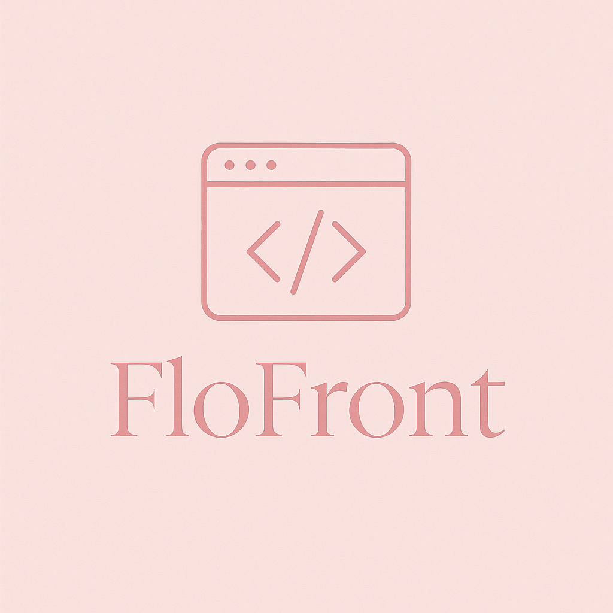

<h1 align="center">Hi there, I'm Florence Kigehi 👋</h1>

  

  <i> Software Engineer | Proficient Frontend Web Developer | ALX Software Engineering(FrontEnd Web Development , Prodev FrontEnd Web Development) Graduate | ALX Cybersecurity Graduate | ALX AI Career Essentials Graduate | Woman in Tech | Cybersecurity Enthusiast</i>

---

## 👩🏽‍💻 About Me  

🌸 I’m an **ALX Software Engineering, ALX Pro-Dev, and ALX Cybersecurity Graduate**, now working as a **proficient web developer** with **basic backend skills**.  

🌱 My mission is to be one of the **greatest women in tech**, creating user-friendly, visually stunning web applications and experiences while ensuring they’re secure and resilient against threats.  

🚀 My skill set includes:
- **Frontend**: HTML5 / CSS3 / JavaScript ES6+ / Responsive Web Design / React  
- **Backend (Basic)**: Node.js / Express.js / MongoDB / Python
- **Cybersecurity**: Secure Web Development Practices / Vulnerability Scanning / Network Security Fundamentals  

🌍 I believe in collaboration, empathy, and building tech for people, not just screens.

---

## ✨ What Inspires Me  

💡 The stories of women breaking barriers in tech  
💪 The challenge of solving problems through design, code, and secure systems  
📱 The power of building projects that can reach anyone, anywhere  

---

## 🔭 Current Focus  

- Creating **high-quality, production-ready web applications**  
- Expanding backend knowledge to become **full-stack**  
- Continuing to apply **cybersecurity principles** in all projects  
- Contributing to open-source and collaborative coding challenges  
- Growing my professional network on [LinkedIn](https://www.linkedin.com/in/florence-kigehi-3401a1316)  

---

## 📈 GitHub Stats  

  

---

## 📌 Let's Connect  

 <a href="https://www.linkedin.com/in/florence-kigehi-3401a1316" target="_blank">LinkedIn</a> •
 <a href="mailto:florencekigehi@gmail.com">Email</a>

---

## 🛠️ Skills & Tools

  <!-- Core Frontend -->
  
  
  
  
  
  
  
  
  
  <!-- Frameworks & Libraries -->
  
  
  
  
  
  <!-- Backend & APIs -->
  
  
  
  
  <!-- Tools & Platforms -->
  
  
  
  
  <!-- Programming Languages -->
  

  <i>"Code like a girl, dream like a queen." 👑</i>

