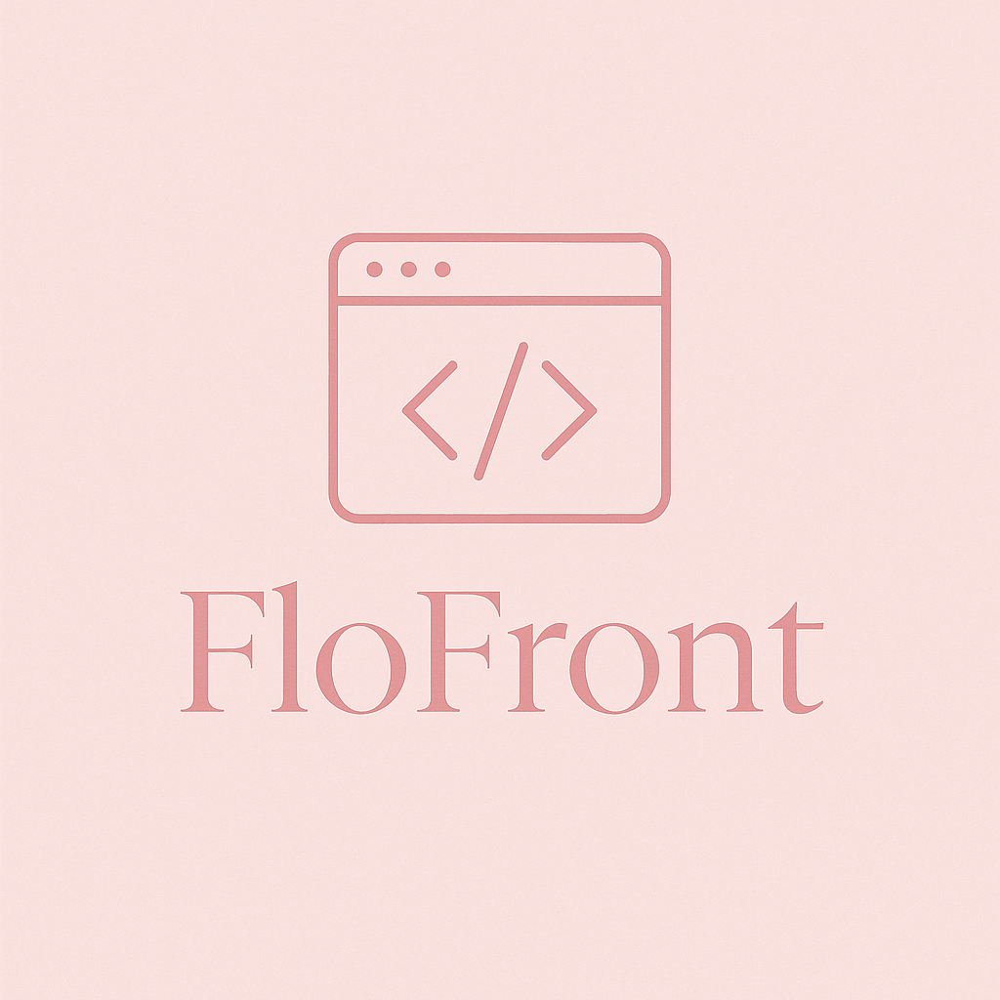

  

<h1 align="left">Florence Kigehi</h1>

  <a href="https://www.linkedin.com/in/florence-kigehi-3401a1316" target="_blank">LinkedIn</a> •
  <a href="mailto:florencekigehi@gmail.com" target="_blank">Email</a>

 

  
  

 

<h2 align="left">🛠 Languages and Tools</h2>

---

  
  
  
  
  
  
  
  
  
  
  
  
  
  
  

 

  

